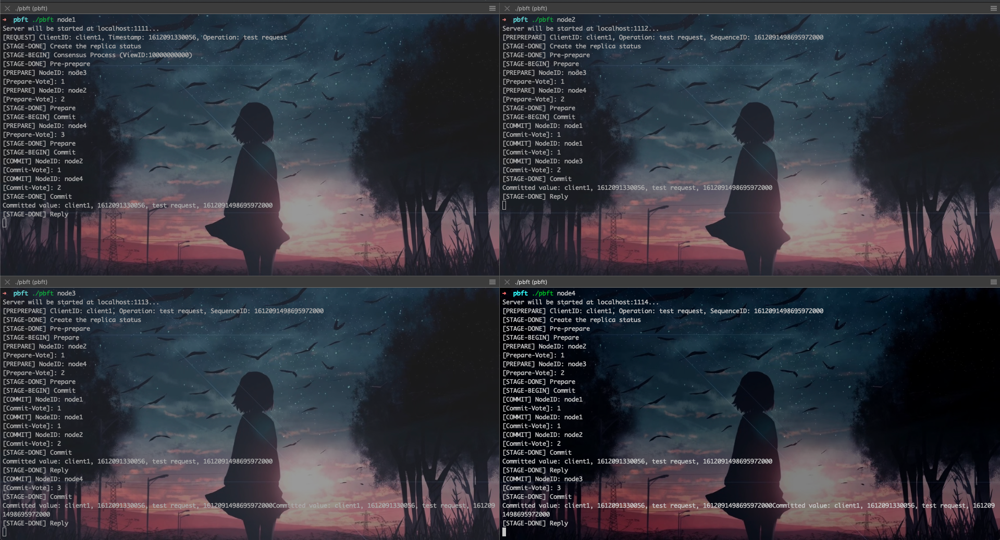

# PBFT实现

实现了一个简易的PBFT

## 编译
移动本文件夹到GOPATH下，进入当前目录```go build```编译代码，会在当前路径下生成一个pbft可执行文件。

## 测试
### 节点
简单期间，本demo直接写死了节点名称和对应的端口，具体定义见```network/node.go:37```NewNode函数
- node1: localhost:1111
- node2: localhost:1112
- node3: localhost:1113
- node4: localhost:1114

### 启动
开启四个终端，进入编译结果所在目录，分别输入
```shell
./pbft node1
./pbft node2
./pbft node3
./pbft node4
```
启动四个节点

### 测试
然后在开启一个终端作为client向任意一个节点发送request请求。 curl示例：
```shell
curl --location --request POST 'http://localhost:1111/req' \
--header 'Content-Type: application/json' \
--data '{
    "clientID": "client1",
    "operation": "test request",
    "timestamp": 1612091330056
}'
```

### 结果图
